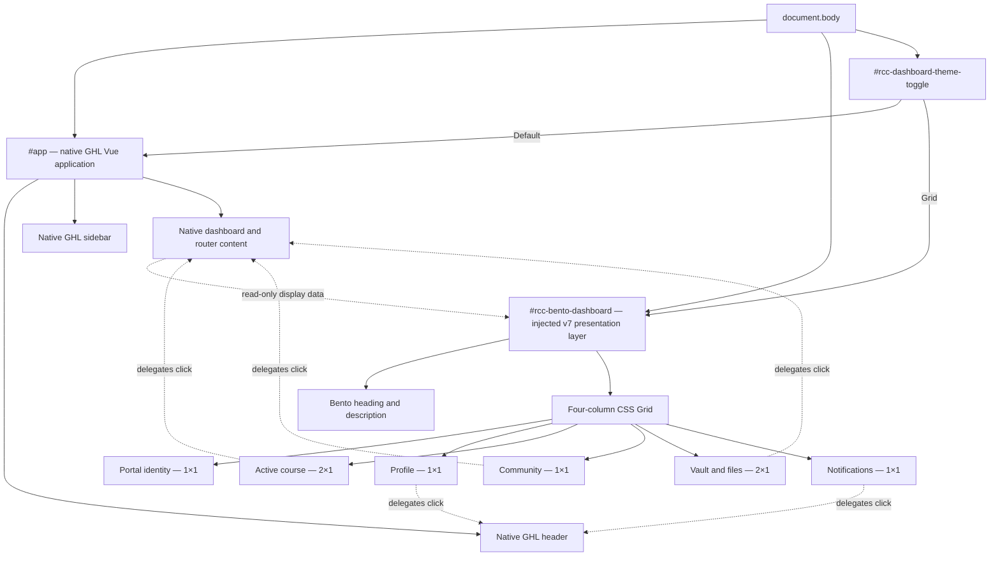

# RCC Portal Bento Dashboard — Release v7

## Purpose

This activity introduces an optional, persistent Bento-style dashboard for the
GoHighLevel (GHL) Portal Home without moving, replacing, or unmounting the native
Vue application.

The implementation is contained in the immutable Cloudflare release bundle:

```text
dist/releases/v7/
├── release.js
├── shared.css
├── portal-home.css
├── portal-home.js
├── community.css
└── community.js
```

Release `v6` remains unchanged and available for rollback.

## Original requested feature

The original feature requested:

1. A user-facing switch between the default Bento dashboard and the Classic GHL
   dashboard with RCC sage styling.
2. Persistence of the selected theme with `localStorage`.
3. A responsive CSS Grid dashboard that hides the native header and sidebar
   while the grid theme is active.
4. The following desktop card hierarchy:
   - RCC Portal identity: 1 column × 1 row.
   - User profile: 1 column × 1 row.
   - Active course highlight: 2 columns × 1 row.
   - Community: 1 column × 1 row.
   - Vault and files: 2 columns × 1 row.
   - Notifications: 1 column × 1 row.
5. One-column mobile degradation.
6. SPA resilience through a `MutationObserver`.
7. Accessible contrast, focus treatment, interaction semantics, and progress
   information.

## Feasibility assessment

### Fully implementable

- An independent Bento presentation layer.
- A persistent Default/Grid toggle.
- Responsive four-column, two-column, and one-column layouts.
- Mirroring portal name, logo, user name, avatar, course progress, file status,
  and notification badge values when those values exist in the rendered DOM.
- Reconciliation after GHL SPA mutations and component re-renders.
- Keyboard-operable cards and toggle controls.
- Accessible progress semantics and visible focus states.
- Reduced-motion behavior.
- Safe fallback when a native feature is unavailable.

### Not safely implementable as direct DOM restructuring

Reparenting GHL components into a new grid was intentionally rejected. GHL owns
the native DOM through Vue, so moving native profile, course, file, or navigation
components could break:

- component ownership and event bindings;
- internal SPA routing;
- dropdown and modal positioning;
- future Vue patches and component replacement;
- native mobile behavior;
- retained state during route transitions.

## Adopted workaround

The Bento dashboard is a separate DOM tree appended directly to `<body>`, as a
sibling of the native `#app` tree.

- `#app` remains mounted in its original structure.
- No GHL/Vue element is reparented.
- The native header and sidebar are only visually hidden in Grid Theme.
- The Bento layer reads display-safe values from native elements.
- Action cards delegate to verified native controls when those controls exist.
- Cards are disabled rather than guessing undocumented GHL routes.
- Leaving Portal Home hides the Bento layer and its toggle.
- Returning to Portal Home restores the saved preference.

## Structural diagram



### Layer behavior

```text
Classic GHL View
┌─────────────────────────────────────────────────────────────┐
│ Native #app: visible, interactive, and styled by RCC v7 CSS │
│ Bento dashboard: mounted but not displayed                  │
│ Toggle: available                                           │
└─────────────────────────────────────────────────────────────┘

Bento Dashboard — Default
┌─────────────────────────────────────────────────────────────┐
│ Bento dashboard: visible fixed presentation layer           │
│ Native #app: still mounted in its original DOM position     │
│ Native header/sidebar: visually hidden, not removed         │
│ Native controls: retained as action delegation targets      │
│ Toggle: available above the Bento layer                      │
└─────────────────────────────────────────────────────────────┘
```

## Theme state

The selected theme is stored under:

```text
rcc:portal-dashboard-theme
```

Supported values are:

```text
default
grid
```

Invalid, missing, unavailable, or blocked storage falls back to `grid`, making
the Bento dashboard the initial experience. An explicitly saved `default` value
continues to restore the Classic GHL view so the user's choice remains persistent.
Storage is scoped to the current browser origin, so production and Cloudflare
preview hostnames maintain separate preferences.

## SPA and MutationObserver strategy

The observer watches the portal document for structural and relevant attribute
changes. Its callback does not rebuild immediately. It schedules a single
reconciliation through `requestAnimationFrame`.

Reconciliation is idempotent:

1. Detect whether Portal Home is currently available.
2. Create the Bento dashboard only if its stable ID is absent.
3. Create the toggle only if its stable ID is absent.
4. Update existing text, images, progress, and availability only when needed.
5. Apply the validated stored theme.
6. Hide injected UI when the user leaves Portal Home.

The injected elements use stable `rcc-*` classes, IDs, and `data-rcc-*`
attributes so repeated GHL renders do not create duplicates.

## Native action delegation

The Bento cards use native controls rather than hard-coded routes:

| Bento card | Native target |
|---|---|
| Profile | `#btn-profile` |
| Active course | `#courses-btn` |
| Community | the unique control labelled `Join a Group` |
| Vault and files | `#add-files` |
| Notifications | the native notification badge's nearest interactive ancestor |

If a target is absent, its Bento card receives `disabled` and
`aria-disabled="true"`. The script does not guess a route.

## Accessibility considerations

- The toggle is a native button using `aria-pressed`.
- Action cards are native buttons.
- Disabled features expose both native disabled state and `aria-disabled`.
- Course completion uses `role="progressbar"`, `aria-valuemin`,
  `aria-valuemax`, and `aria-valuenow`.
- DOM order matches visual and keyboard order.
- Focus indicators use the dark RCC sage token against light surfaces.
- The course card uses white text on dark sage.
- Mobile layout becomes a single column.
- Motion is removed under `prefers-reduced-motion: reduce`.
- Images are decorative because the same identity is available as text.

## Known limitations

1. The implementation depends on stable native IDs and accessible labels. If
   GHL changes them, the affected card disables safely until selectors are
   updated in a new release.
2. Notification details are not duplicated. Only an available badge value is
   mirrored, and the card delegates to the native notification UI.
3. Profile menus, upload dialogs, and course navigation remain owned by GHL.
4. LocalStorage preferences do not synchronize between browsers, devices, or
   domains.
5. The downloaded static production render blocks JavaScript intentionally, so
   full interactive QA must use the Cloudflare `v7` preview bundle in a
   controlled GHL portal session.
6. GHL may replace utility-class selectors during a platform release. Stable
   IDs are preferred, but identity text currently requires a scoped utility
   selector with a safe fallback.

## Files changed for v7

### `dist/releases/v7/portal-home.css`

- Preserves the RCC v6 Portal Home theme.
- Includes the RCC course-button and native progress-ring refinements prepared
  for the next release.
- Adds the Bento overlay, grid hierarchy, card presentation, theme toggle,
  responsive breakpoints, focus states, and reduced-motion rules.

### `dist/releases/v7/portal-home.js`

- Injects the independent Bento dashboard and toggle.
- Stores and restores the theme preference.
- Mirrors safe native display data.
- Delegates supported actions to existing native controls.
- Reconciles the presentation after SPA mutations.
- Reports `v7` in the `rcc:surface-ready` event.

### `dist/releases/v7/release.js`

- Reports and loads release `v7` assets.

## Deployment and QA boundary

This activity creates a local `v7` candidate. It does not by itself authorize a
commit, push, Cloudflare preview deployment, GHL loader change, or production
promotion.

Before promotion:

1. Run JavaScript syntax and patch checks.
2. Review the complete `v6` → `v7` diff.
3. Commit the complete `v7` bundle to `dev`.
4. Verify all six assets on an immutable Cloudflare preview hostname.
5. Load the preview `v7/release.js` in a controlled GHL test portal.
6. Test both themes, refresh persistence, SPA navigation, native delegated
   actions, mobile layout, keyboard navigation, and reduced motion.
7. Promote the exact approved commit to `main`.
8. Update the production GHL loader from `v6` to `v7`.
9. Keep `v6` available for immediate rollback.
