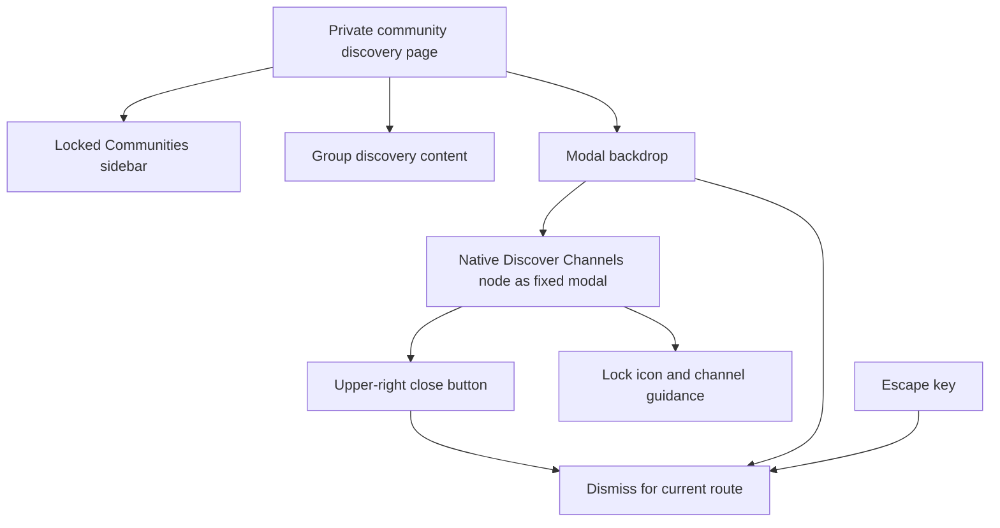

# RCC Discovery Modal and Early Loader Guard — v9

## QA findings from v8

The v8 immutable preview passed:

- Bento teardown before course navigation;
- locked Community navigation in the sidebar;
- removal of the top Community switcher.

It failed or exposed:

1. the default GHL layout still flashed before external RCC assets initialized;
2. the native Discover Channels panel was squeezed between the injected
   Community sidebar and the main private-group content.

Because v8 has already been served with immutable caching, corrections are
implemented in v9.

## Flash fix

The flash begins before external `release.js` can execute. The fix is split
between:

- an early guard pasted directly into GHL Advanced Custom JavaScript; and
- the existing release preloader lifecycle in v9 `release.js`.

The GHL guard immediately adds `rcc-release-loading`, hides `#app`, and renders
the RCC loading veil before requesting Cloudflare. The external release removes
the guard after surface CSS loads and enhancement finishes.

See `GHL-ADVANCED-CUSTOM-JAVASCRIPT-V9.md` for the required loader.

## Discover Channels modal

The native element with ID `side-bar h-container` remains mounted in its
original Vue structure. Community JavaScript adds modal semantics without
reparenting it:

- `role="dialog"`;
- `aria-modal="true"`;
- accessible heading association;
- close button in the upper-right corner;
- backdrop click dismissal;
- Escape-key dismissal;
- per-route dismissal memory to prevent MutationObserver-driven reopening.



The modal opens when a private discovery surface is first enhanced. It remains
closed for that pathname after dismissal, even if GHL mutates the DOM. Navigating
to another private discovery route allows its modal to open once.

## Release files

```text
dist/releases/v9/
├── release.js
├── shared.css
├── portal-home.css
├── portal-home.js
├── community.css
└── community.js
```

Release identity is updated to v9 in `release.js`, `portal-home.js`, and
`community.js`. Unchanged assets remain part of the complete immutable bundle.

## Required QA

1. Use the early v9 GHL loader from the accompanying loader document.
2. Confirm no default GHL flash on hard refresh.
3. Confirm no flash on SPA Community navigation.
4. Open a private-group discovery route.
5. Confirm Discover Channels is centered as a modal and no longer affects page
   columns.
6. Close it with the upper-right close button.
7. Reopen the route and close it by clicking the backdrop.
8. Reopen the route and close it with Escape.
9. Confirm GHL mutations do not reopen it on the same route.
10. Confirm the locked Communities sidebar remains usable behind the modal after
    dismissal.
11. Repeat the successful v8 course, Bento, sidebar, and header checks.

## Rollback

If v9 fails QA, retain v8 in production. If v9 is promoted and fails after
activation, restore the backed-up v8 GHL loader. Do not edit served v9 files;
correct forward in v10.
