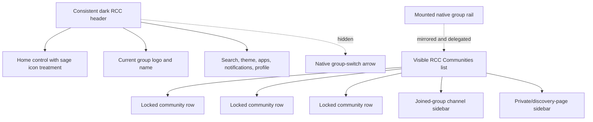

# RCC Route, Navigation, Sidebar and Loading Refinements — v8

## Objective

Release v8 follows the immutable v7 Bento release and addresses cross-surface
behavior throughout GHL:

- show Bento only on Portal Home;
- remove Bento immediately when course or community navigation starts;
- keep the RCC-styled native application on all other portal pages;
- make the Community header and sidebar consistent across timeline, channel,
  discovery, learning, member, and private-group routes;
- replace the top-bar community switcher with a sidebar community list;
- show private/locked status in that community list;
- prevent the default GHL layout from flashing before RCC customization applies.

## Release boundary

```text
Base release:      v7
Candidate release: v8
Working branch:    dev
```

Published v7 assets remain unchanged. All adjustments are contained in:

```text
dist/releases/v8/
```

## Bento route boundary

The injected Bento dashboard is now valid only when the normalized pathname is:

```text
/home
```

The presence of a GHL `.nav-container` by itself is no longer sufficient to
activate Bento. Course, account, application, and other GHL pages can share that
container but must retain their native structure.

Course and Community Bento actions perform an immediate visual teardown before
delegating to the native GHL control. The saved Bento preference is not changed.
Returning to `/home` restores the user's preference.

## Community navigation structure

The native group-switch arrow beside `#group-info` is visually removed. The
group identity remains in the header.

The existing source group buttons remain mounted as native delegation targets,
but the visible navigation is an RCC community list injected into:

1. the channel-list content on joined group pages; or
2. the primary Community sidebar on discovery/private-group pages.

Every injected row:

- retains native click delegation;
- exposes active-page state with `aria-current="page"`;
- is labelled as a private community;
- displays a locked indicator;
- disables no native routing or Vue ownership.



## Loading veil

The v8 release loader installs a small inline loading veil before requesting the
surface stylesheet. This is intentionally part of `release.js` rather than a
surface stylesheet so it can hide the native app before asynchronous RCC assets
finish loading.

Initial sequence:

```text
release.js starts
  → add rcc-release-loading to <html>
  → hide #app and show neutral RCC spinner
  → load shared.css
  → detect surface
  → load the surface CSS
  → after CSS load, load the surface JavaScript
  → enhance the surface
  → receive rcc:surface-ready / rcc:loading-end
  → remove the veil after two animation frames
```

SPA sequence:

```text
pushState / replaceState / popstate
  → show loading veil
  → allow GHL to render the destination
  → run RCC route reconciliation
  → remove veil after enhancement
  → use a five-second fail-safe if an expected event never arrives
```

The spinner respects reduced-motion preferences by slowing its animation. The
five-second fail-safe ensures a failed optional enhancement cannot leave the
portal permanently hidden.

## Icon treatment

The broad Community header rule still provides white text and general utility
icons on the charcoal bar. The Home control now receives a separate semantic
class and targeted sage-light treatment, preventing the blanket white rule from
overriding its intended state.

The removed group switcher no longer competes with the sidebar community list.
The current group logo and name remain visible and consistently styled.

## Files changed

### `release.js`

- reports `v8`;
- installs and controls the early loading veil;
- waits for surface CSS before loading surface JavaScript;
- patches SPA history transitions for graceful loading;
- retains a fail-safe timeout.

### `portal-home.js`

- reports `v8`;
- limits Bento activation to `/home`;
- hides Bento immediately for course/community actions;
- preserves and restores the stored Bento preference.

### `community.js`

- reports `v8`;
- adds semantic navigation hooks;
- removes the visible top group switcher through a hook;
- injects the community list in joined and discovery sidebars;
- adds locked indicators;
- coordinates loading events around SPA enhancement.

### `community.css`

- provides consistent header control styling;
- hides the redundant group switcher;
- styles the Home icon independently;
- supports the standalone discovery-page community list;
- styles locked indicators.

## QA requirements

Before promotion, test from an immutable Cloudflare v8 preview:

1. `/home` initially shows Bento for a new preference.
2. Continue Course removes Bento before the course view appears.
3. Other non-home portal pages never show Bento.
4. Returning to `/home` restores the saved preference.
5. Joined Community pages show the community list above channels.
6. Private discovery pages show the same community list in the primary sidebar.
7. Every community row shows a locked indicator and delegates correctly.
8. The top group switch arrow is absent.
9. Home, group identity, search, apps, notifications, and profile align
   consistently across Community routes.
10. The Home icon uses the targeted sage-light state rather than blanket white.
11. Initial page loads do not flash the default GHL layout.
12. SPA transitions show the veil briefly and never leave the page hidden.
13. Reduced-motion mode remains usable.
14. v7 continues to match its published immutable files.

## Rollback

If v8 fails QA, keep GHL on v7. If v8 reaches production and requires rollback,
change the GHL loader back to:

```javascript
var release = "v7";
```

Do not modify a served v8 directory. Correct forward in v9.
